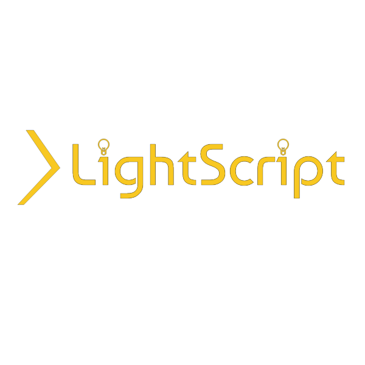

<h2>Smarter Lighting with PowerShell</h2>

LightScript is a PowerShell module to control smart lights.

It currently can control:

* [Philips Hue Bridges](https://www.philips-hue.com/)
* [NanoLeaf](https://nanoleaf.me/)
* [Twinkly](https://www.twinkly.com/)
* [Divoom Pixoo64](https://www.divoom.com/products/pixoo-64)

The goal of LightScript is to let you control every light in your house, and do more than what most applications will let you.

If you have any additional lights you'd like to support, file an issue, or consider contributing.

## Installing LightScript

LightScript is on the PowerShell Gallery.  To install it, simply run:

~~~PowerShell
# Install LightScript
Install-Module LightScript -Scope CurrentUser

# Import LightScript
Import-Module LightScript -Force -PassThru
~~~

## Philips Hue Bridges

Hue Bridges let you control every Philips Hue (or compatible ZigBee) light in your house.

To get started with LightScript and your Hue Bridge **press the link button and run this command in the next 30 seconds**:

~~~PowerShell
Find-HueBridge | Connect-HueBridge
~~~

LightScript will remember this Hue Bridge, so you only have to run this once per machine.

After you're set up, run

~~~PowerShell
Get-HueLight
~~~

Now try setting the lights:

~~~PowerShell
# Make the color temperature a warm afternoon (This should work on all bulbs).
Set-HueLight -ColorTemperature 425 

# Make a bedroom pink (This should work on all color bulbs)
Set-HueLight -RoomName Bedroom -Hue 340 -Saturation .8 -Brightness 1

# Make the kitchen a light blue
Set-HueLight -RoomName Kitchen -RGBColor "#1245ab"

# Turn off the light Nightstand1
Set-HueLight -Name Nightstand1 -Off

# Make all of the lights blink once
Set-HueLight -Alert select

# Make all of the lights loop color
Set-HueLight -Effect colorloop

# Make all of the lights stop looping color
Set-HueLight -Effect none
~~~

Bridges also coordinate schedules, read and write sensors, and process rules.
~~~PowerShell
# Get all of the sensors
Get-HueSensor 

# Read the daylight sensor
Read-HueSensor -Name Daylight

# Add a schedule to blink all lights in 10 minutes
# (this is great for the oven)
Add-HueSchedule -In '00:10:00' -Command (Set-HueLight -Alert lselect -OutputInput) -Name Blink10
~~~

You can also add new lights to a bridge:

~~~PowerShell
Add-HueLight

Get-HueLight -New
~~~

### Hue Devices and Smart Aliases

Set-HueLight supports smart aliasing.
This means that you can run Set-HueLight by any name of a light (or room).  
This syntax will be available after you re-import.  Once you've connected, you should be able to:

~~~PowerShell
# Set a light by name
LightStrip1 -RGBColor "#1245ab"

# Set a whole room by name
Bedroom -On -ColorTemperature 425
~~~

## NanoLeaf

NanoLeaf is a flexible multipanel light with a built-in microphone for music effects.

On Windows, you can Find-NanoLeaf to discover devices.  

NanoLeaf devices tend to be a little slower to respond to SSDP requests, and so you may have to increase your timeout, depending on your network quality.

To pair, **press the link button and run this command in the next minute**

~~~PowerShell
Find-NanoLeaf | Connect-NanoLeaf
~~~

Once you have the nanoleaf connected, you can:

~~~PowerShell
# Get information about each NanoLeaf
Get-NanoLeaf

# Get a list of panels from each NanoLeaf
Get-NanoLeaf -Panel

# List plugins on the device
Get-NanoLeaf -ListPlugin

# List effects on the device
Get-NanoLeaf -ListEffect

# Set all NanoLeaf devices to a color temperature
Set-NanoLeaf -ColorTemperature 6500

# Make all NanoLeaf devices dim
Set-NanoLeaf -Brightness .1

# Make them bright again
Set-NanoLeaf -Brightness 1

# Directly use a plugin
Set-NanoLeaf -Palette "#ff0000","#00ff00", "#0000bb" -PluginName Wheel 

# Directly use a plugin with an option
Set-NanoLeaf -Palette "#ff0000","#00ff00", "#0000bb" -PluginName Wheel -EffectOption @{linDirection='up'}

# Set a series of panels
Set-NanoLeaf -Panel @{
    1234 = "#ff0000" # set a series of panels
}

# Enable fast external control
Set-NanoLeaf -ExternalControl

# Set a series of panels, via UDP
Set-NanoLeaf -Panel @{
    1234 = "#ff0000" # set a series of panels
} -AsByteStream

# Set all panels to an RGB Color
Set-NanoLeaf -RGBColor "#00ff00",

# Set all panels to fade between two RGB Colors
Set-NanoLeaf -RGBColor "#012356", "#1245ab"

# Set all nanoleafs to an effect name.
# Effect names are currently case-sensitive.
Set-NanoLeaf -EffectName 'Blaze'

# You can also Watch for nanoleaf touch events:
Watch-NanoLeaf

# This will allow you use Register-EngineEvent to handle events, like whenever a panel is touched.
Register-EngineEvent -SourceIdentifier NanoLeaf.Touch.Down -Action {
    $event.MessageData | Out-Host 
}

~~~

## Twinkly

Twinkly makes smart lights with per-LED control.

The Twinkly app will show you the IP Address for a Twinkly device.  Once you know this, run:

~~~PowerShell
Connect-Twinkly -IPAddress $TheTwinklyIPAddress
~~~

Once authenticated, you can:

~~~PowerShell
# Get information about your lights
Get-Twinkly

# Set your Twinkly into demo mode:
Set-Twinkly -Mode Demo

# Make your lights Red:
Set-Twinkly -Mode Color
Set-Twinkly -RGBColor "#ff0000"

# Make your lights pink:
Set-Twinkly -Hue 340 -Saturation .8 -Brightness 1

# Make your lights a color temperature (LightScript approximates the api)

# Make a pattern that alternates your lights from red to green
Set-Twinkly -RGBColor "#ff0000", "#00ff00" -MovieFrameCount 2
Set-Twinkly -Mode Movie
~~~

### A Note On Twinkly Local Authentication (or lack thereof)

Unlikely NanoLeaf or Hue, Twinkly does not require you to press anything on the device to pair it.

Unfortunately, it only allows one connection at a time, and the tokens it provides expire after a few hours.

As such, you are quite likely to encounter the error "The Code is Invalid" when working with Twinkly in LightScript.  

This will happen after the app is used, or after a few hours.  Don't panic.  Just run:

~~~PowerShell
# This will reconnect a Twinkly device.
Get-Twinkly | Connect-Twinkly
~~~

## Pixoo64

The Pixoo App will let you know the device's IP address.  From there, you can:

~~~PowerShell
Connect-Pixoo -IPAddress 1.2.3.4
~~~

To list connected devices, use:

~~~PowerShell
Get-Pixoo
~~~

Here are a few things you can do with your Pixoo:

~~~PowerShell
Set-Pixoo -Channel Cloud # Switch to the cloud Channel

Set-Pixoo -Channel Visualizer # Switch to the visualizer

Set-Pixoo -Visualizer 20 # Switch to a hidden visualizer

Set-Pixoo -Stopwatch Start # Start a Stopwatch

Set-Pixoo -Stopwatch Reset # Reset a Stopwatch

Set-Pixoo -Timer "00:01:00" # Set a timer for one minute

Set-Pixoo -RedScore 1 -BlueScore 0 # Keep a scoreboard
~~~

## Elgato Key Lighting

Elgato makes Key Lighting for video recording and streaming.

The Elgato Control Center will show you the IP Address of your Key Lights from the Accessories' settings.

Once you know this, run:

~~~PowerShell
Connect-KeyLight -IPAddress $TheKeyLightIPAddress
~~~

Once authenticated, you can:

~~~PowerShell
# Get information about your lights
Get-KeyLight

# Turn on your Key Light:
Set-KeyLight -On

# Change the brightness and ColorTemperature:
Set-KeyLight -ColorTemperature 270 -Brightness 0.25

# Turn on and change the brightness at the same time:
Set-KeyLight -On -Brightness 0.25
~~~

